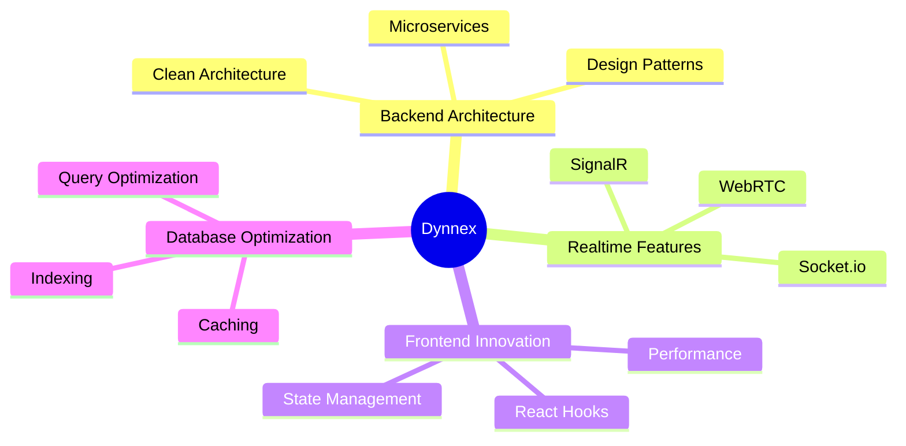

<!-- Animated Typing -->

  

<!-- Animated Divider -->

## 🎯 **About Me**

<table>
<tr>
<td>

**👨‍💻 Role:** Software Engineer & Fullstack Developer

**📍 Location:** Vietnam 🇻🇳

**💻 Languages:** JavaScript • TypeScript • C# • SQL

**⚡ Frontend:**
- Frameworks: React, Next.js
- Styling: TailwindCSS, Bootstrap, CSS3
- State Management: Redux, Context API, Zustand

**🚀 Backend:**
- Node.js, Express.js, Socket.io
- ASP.NET Core, Entity Framework, SignalR
- SQL Server, MySQL, MongoDB

**🛠️ DevOps:** Docker • Azure • Git • Postman

**🎯 Current Focus:** Realtime Communication & System Design

**🏗️ Architecture:** Clean Architecture • Microservices • RESTful API • MVC

**💡 Challenge:** Building something impactful every single day

**☕ Fun Fact:** My code runs smoother after my 3rd cup of coffee

</td>
</tr>
</table>

<!-- Animated Divider -->

## 🛠️ **Tech Arsenal**

### **Frontend Development**

### **Backend Development**

### **Databases**

### **Tools & DevOps**

<!-- Animated Divider -->

## 📊 **GitHub Analytics**

  
  

  

  

  
  

  
  

<!-- Animated Divider -->

## 🏆 **Achievements**

🌟 **10+ Projects Completed**  
⚡ **500+ Commits This Year**  
🚀 **5+ Tech Stacks Mastered**  
💡 **Always Learning & Growing**

<!-- Animated Divider -->

## 📈 **Contribution Graph**

  

<!-- Animated Divider -->

## 🎯 **Current Focus**

<!-- Animated Divider -->

## 🌐 **Connect With Me**

<!-- Animated Divider -->

## 💭 **Quote of the Day**

<!-- Animated Divider -->

## 📈 **Profile Stats**

<!-- Animated Footer -->

### 💡 *"Code is like humor. When you have to explain it, it's bad."* – Cory House

### ⚡ **Powered by passion, driven by code, fueled by coffee** ☕

